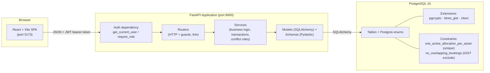
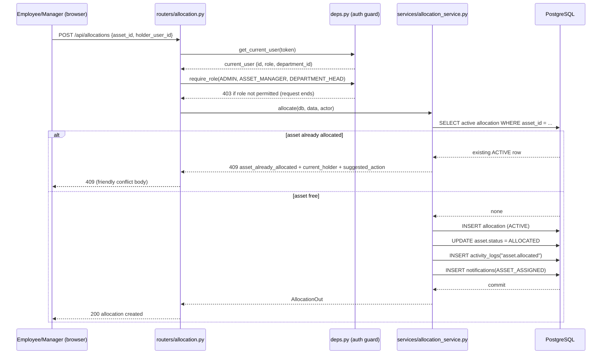
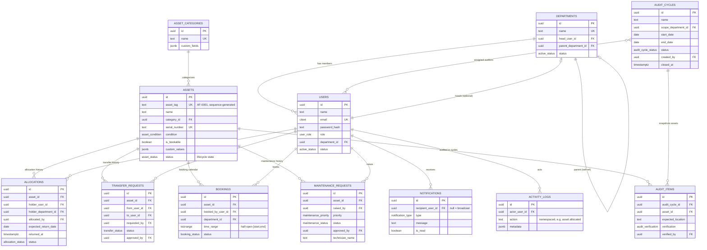
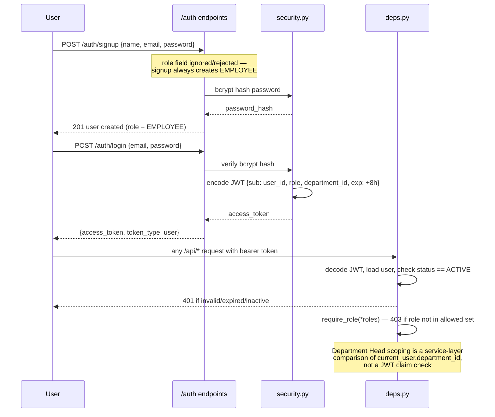
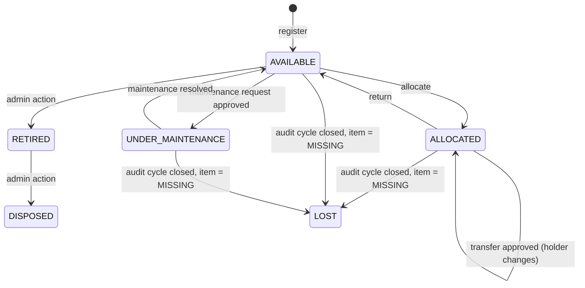
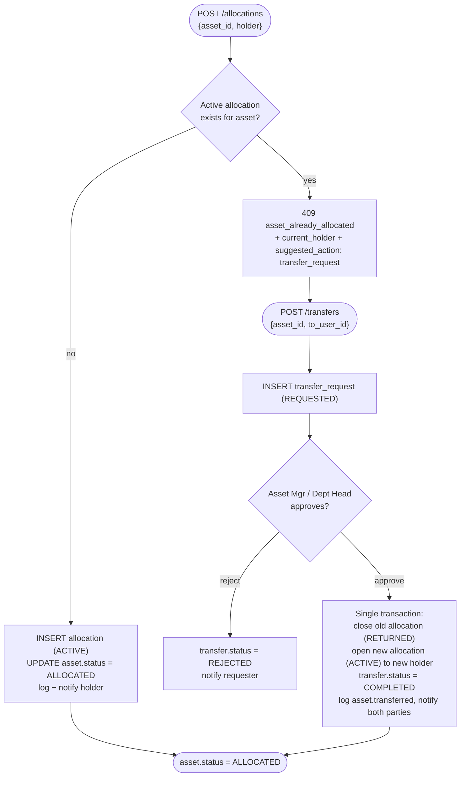
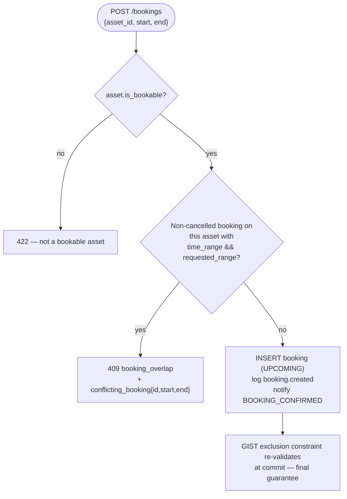
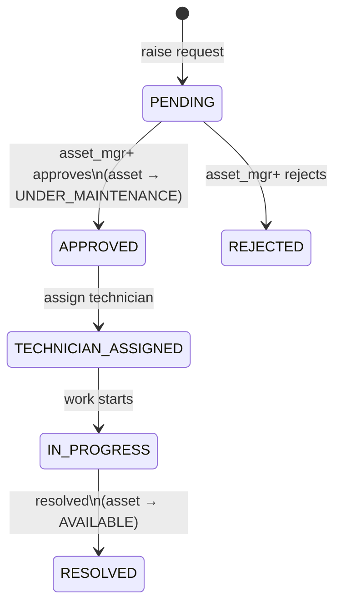
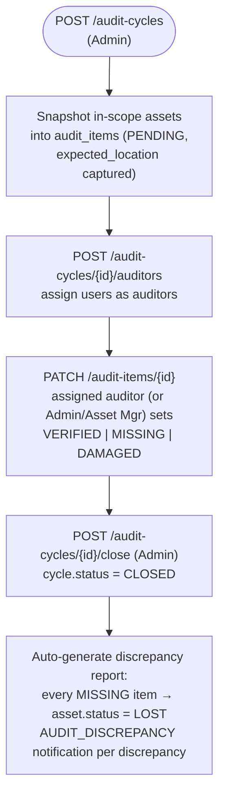
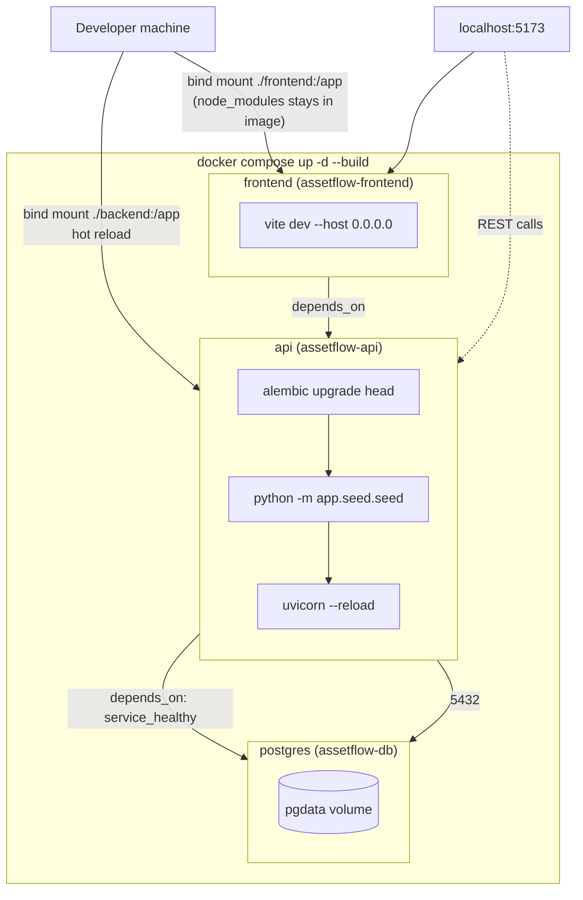

# AssetFlow

**Enterprise Asset & Resource Management System** — track every asset from registration to
retirement: who holds it, who booked it, who's fixing it, and whether it's actually where the
audit says it should be.

Built in an 8-hour hackathon sprint by a 4-developer team plus an integration lead, on a
frozen contract-first design so every track could parallelize from minute one.

[]()
[]()
[]()
[]()

---

## Why it's interesting

Most CRUD asset trackers stop at "create, read, update." AssetFlow enforces the two rules that
actually make an asset registry trustworthy, at **both the application layer and the database
layer**, so they can never be bypassed by a bug, a race condition, or a second person clicking
at the same time:

- **Double-allocation is structurally impossible.** A Postgres partial unique index
  (`one_active_allocation_per_asset`) guarantees at most one open allocation per asset. The
  service layer checks this first and returns a friendly `409` naming the current holder and
  offering a transfer — the database constraint is the backstop if it doesn't.
- **Booking overlaps are structurally impossible.** A `GIST` exclusion constraint
  (`no_overlapping_bookings`, via `btree_gist` on `tstzrange`) makes two conflicting bookings
  for the same resource physically unrepresentable in the table, with the same friendly-`409`
  service pre-check in front of it.

Everything else — allocation, transfer approvals, maintenance kanban, audit cycles, dashboards,
reports, notifications — is built around those two guarantees.

## Feature tour

| Area | What it does |
|---|---|
| **Auth & RBAC** | Self-rolled JWT auth (bcrypt + `python-jose`). Signup always creates an `EMPLOYEE`; roles change only via the Admin-driven employee directory — never self-assigned. |
| **Org setup** | Departments (with parent/child hierarchy), asset categories with JSON custom fields, employee directory with role/status management. |
| **Asset registry** | Auto-generated tags (`AF-0001`, `AF-0002`, …) via a DB sequence — no race conditions under concurrent registration. Full lifecycle status, condition, location, custom field values. |
| **Allocation & transfer** | Allocate/return with condition notes; request → approve/reject transfer workflow that atomically re-allocates in one transaction. |
| **Resource booking** | Calendar-style booking for bookable assets (rooms, vehicles) with derived `UPCOMING → ONGOING → COMPLETED` status and hard overlap prevention. |
| **Maintenance** | Kanban workflow (`PENDING → APPROVED → TECHNICIAN_ASSIGNED → IN_PROGRESS → RESOLVED`, or `REJECTED`) that drives the asset's lifecycle status automatically. |
| **Audit cycles** | Scoped audit cycles with assigned auditors, snapshot-based audit items, and an auto-generated discrepancy report on close — missing items flip the asset to `LOST`. |
| **Dashboard & reports** | Live KPIs (overdue returns highlighted), utilization/idle/most-used/maintenance-frequency/booking-heatmap reports, CSV export. |
| **Notifications & activity log** | Event-driven notifications (assignment, approval, booking, transfer, audit) plus derived ones (`OVERDUE_RETURN`, `BOOKING_REMINDER`) computed on read since there's no scheduler. Namespaced, append-only activity log for every state change. |

See [`docs/design.md`](docs/design.md) for the frozen source-of-truth spec, and
[`docs/ARCHITECTURE.md`](docs/ARCHITECTURE.md) for data models, workflows, and diagrams.

## Tech stack

| Layer | Choice |
|---|---|
| Backend | Python, **FastAPI**, **SQLAlchemy 2.0**, **Alembic**, **Pydantic v2**, Uvicorn |
| Database | **PostgreSQL 16** (`pgcrypto`, `btree_gist`, `citext` extensions) |
| Auth | JWT (`python-jose`) + `passlib[bcrypt]` — no managed BaaS, no RLS; authorization lives in FastAPI dependencies |
| Frontend | **React** + **Vite** |
| Packaging | **Docker Compose** — one command builds and runs the whole stack |
| Quality | `ruff` (lint + format), `pytest` |

## Quick start

Requires Docker and Docker Compose. No local Python/Node install needed.

```bash
git clone https://github.com/isha0419/odoo-hackathon-project.git
cd odoo-hackathon-project
docker compose up -d --build
```

That single command:
1. Builds the `postgres`, `api`, and `frontend` images.
2. Starts Postgres and waits for its healthcheck.
3. Runs `alembic upgrade head` — creates every table, enum, and constraint from a clean DB.
4. Runs the idempotent demo seed (`app.seed.seed`) — departments, categories, ~50 assets,
   allocations, bookings, maintenance requests, an audit cycle, notifications, activity log.
5. Starts the API (hot-reload) and the frontend dev server (hot-reload).

Then open:
- **Frontend:** http://localhost:5173
- **API docs (Swagger):** http://localhost:8000/docs

The seed script prints a demo login table (admin / asset manager / department head / employee
accounts) to the `api` container logs on first boot:

```bash
docker compose logs api | grep -A 20 "Demo logins"
```

**Useful commands:**

```bash
docker compose down                                   # stop (data persisted)
docker compose down -v                                # stop + wipe DB (fresh start)
docker compose logs -f api                             # tail API logs
docker compose exec api python -m app.seed.seed --reset # force a clean re-seed
docker compose exec api pytest                          # run backend tests
docker compose exec api ruff check .                    # lint
```

## Best practices baked into the build

- **Contract-first parallel development.** The data model, enums, and full API surface were
  frozen in [`docs/design.md`](docs/design.md) *before* any track wrote code, so four
  developers could build against agreed contracts simultaneously instead of blocking on each
  other. See Section 12 of the design doc for the track/ownership split.
- **Layered architecture, enforced by folder.** `routers/` (HTTP + auth guard, thin) →
  `services/` (business logic, transactions, conflict rules) → `models/` (SQLAlchemy) +
  `schemas/` (Pydantic). Routers never touch the ORM directly; services never touch
  `Request`/`Response`.
- **Defense in depth on the two conflict-prone workflows.** Both crown-jewel rules (double
  allocation, booking overlap) are enforced at the service layer *and* the database layer —
  the friendly error comes from the service, the guarantee comes from the constraint.
- **One shared write point.** `main.py` is touched only to add `app.include_router(...)`
  lines, alphabetized, one per module — this was the single shared file across four parallel
  tracks and kept merges conflict-free.
- **Idempotent, deterministic seeding.** The seed script upserts by natural key
  (`get_or_create`), seeds timestamps relative to `now()` (not hard-coded dates) so
  overdue/upcoming demo data is always correct whenever the stack starts, and is
  deterministic (`random.seed(42)`) so every teammate sees the same demo data.
- **One-command, zero-manual-step orchestration.** `docker compose up -d --build` builds,
  migrates, seeds, and serves — no separate terminal commands, no forgetting a step before a
  demo.
- **Hot-reload dev volumes, immutable `node_modules`.** Source is bind-mounted for instant
  reload; the frontend container keeps its own build-time `node_modules` via an anonymous
  volume so host/container dependency drift can't happen.
- **Git worktrees for isolated fix branches.** Integration/review fixes are made on dedicated
  branches in separate worktrees, never on the shared working directory teammates are actively
  using — avoids cross-branch commit accidents during parallel development.

## Repository layout

```
odoo-hackathon-project/
├── docker-compose.yml         # one command: build + migrate + seed + run everything
├── docs/
│   ├── design.md              # frozen source-of-truth spec
│   ├── ARCHITECTURE.md         # data models, workflows, diagrams (this build's actual state)
│   └── implementation_plan.md # stage-by-stage task breakdown
├── backend/
│   ├── Dockerfile
│   ├── requirements.txt
│   ├── alembic/versions/      # one migration history, shared across all tracks
│   └── app/
│       ├── main.py            # app factory + router registration only
│       ├── config.py          # settings from env
│       ├── db.py               # engine, SessionLocal, get_db()
│       ├── security.py        # hashing, JWT encode/decode
│       ├── deps.py             # get_current_user, require_role(...)
│       ├── models/             # one file per entity (SQLAlchemy)
│       ├── schemas/            # one file per module (Pydantic)
│       ├── routers/            # one file per module (HTTP layer)
│       ├── services/           # one file per module (business logic)
│       └── seed/seed.py        # demo data generator
└── frontend/                  # React + Vite, consumes the API above
```

## License

Not yet specified.

# AssetFlow (Odoo Hackathon Project)

AssetFlow is a comprehensive Asset Management System designed to seamlessly manage the complete lifecycle of assets, allocations, resource bookings, maintenance, and audits. 

The system is fully stabilized and features a robust backend (PostgreSQL + FastAPI) with a dynamic frontend (React).

---

## E2E Browser Testing Walkthrough

The backend is fully stabilized with the proper official seed data. We have executed an end-to-end automated browser test to verify that the frontend completely integrates with the backend and displays data correctly.

Here are the results of the complete workflow:

### 1. Authentication & Dashboard
The system successfully logs in Admin users (`admin@assetflow.io`) and displays the dashboard. The dashboard successfully aggregates all backend metrics (Available, Allocated, Under Maintenance, etc.) and lists recent activity.


### 2. Asset Registry & Filtering
The Assets page displays all seeded assets. The search filter correctly narrows the table down to just "Laptop" devices, proving the backend API search logic works seamlessly with the UI.


### 3. Allocations
The Allocations page successfully loads, allowing users to search for specific asset tags (e.g. `AF-0114`) and see active holders, expected return dates, and historical transfer requests.


### 4. Resource Bookings (Crown Jewel)
The Resource Booking calendar successfully loads, visually mapping out upcoming reservations and preventing overlapping timeslots in the frontend scheduler via backend ExcludeConstraints.


### 5. Maintenance Kanban Board
The Maintenance page features a fully functional Kanban board. Requests are cleanly organized into their respective statuses (Pending, Approved, In Progress, Resolved).


---

## Architecture (Headings & Diagrams from `docs/ARCHITECTURE.md`)

### Table of contents

### 1. System architecture



### 2. Layered request flow



### 3. Data model



#### Crown-jewel constraints

### 4. Authentication & authorization



#### Role / permission matrix

### 5. Asset lifecycle



#### Related state machines

### 6. Core workflows

#### 6.1 Double allocation & transfer (crown jewel #1)



#### 6.2 Booking overlap (crown jewel #2)



#### 6.3 Maintenance kanban



#### 6.4 Audit cycle



### 8. Deployment architecture



> For full architectural explanations and tables, see `docs/ARCHITECTURE.md`.


  
