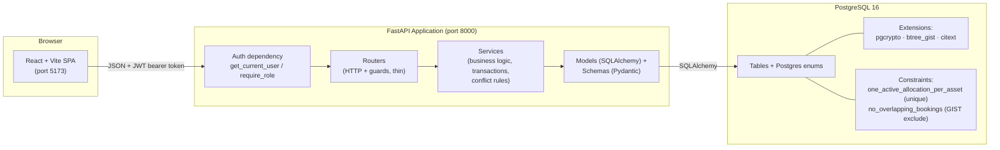
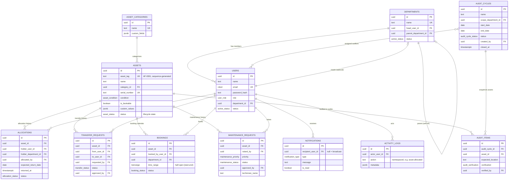
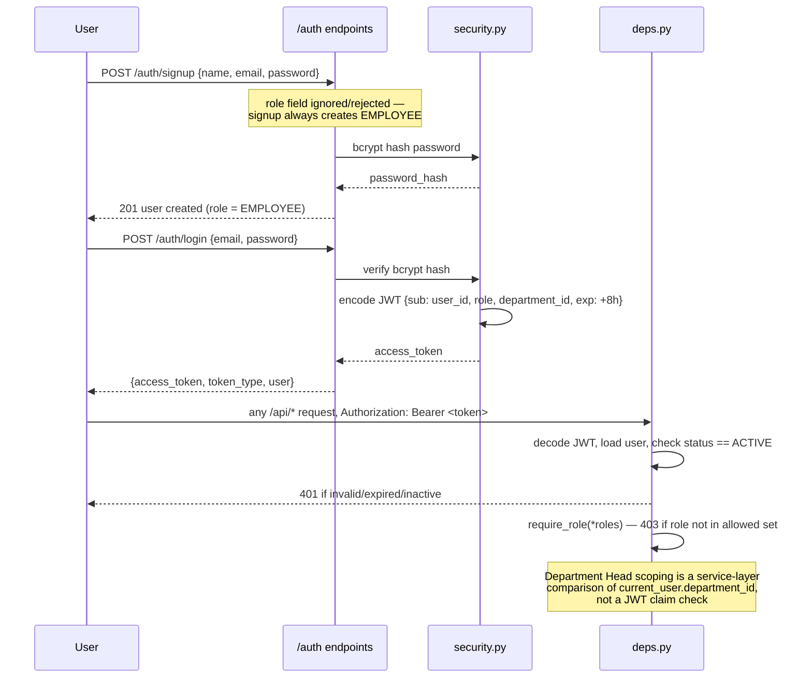
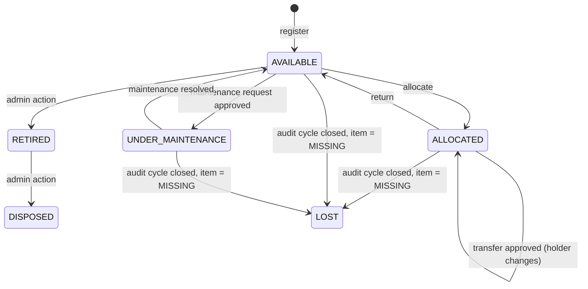
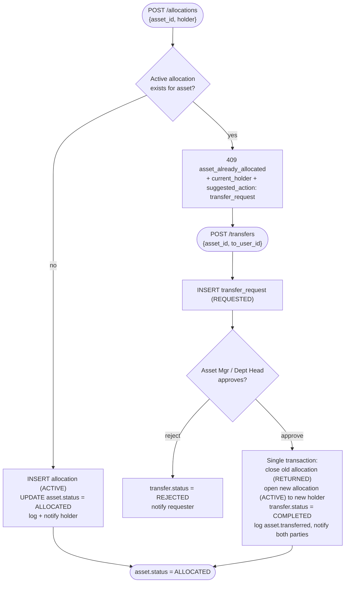
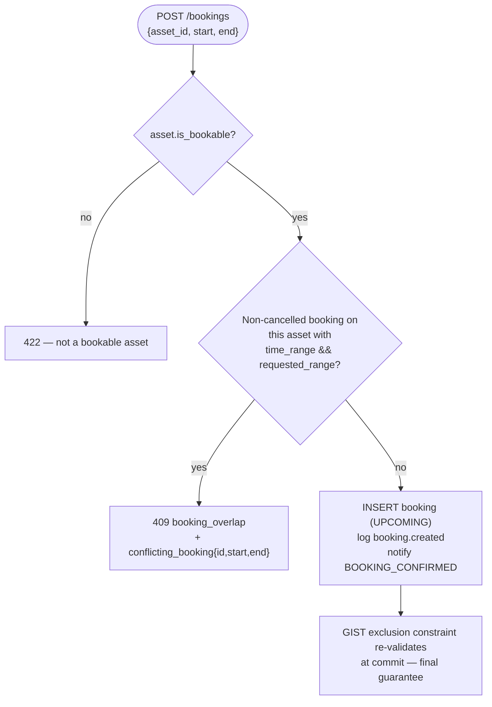
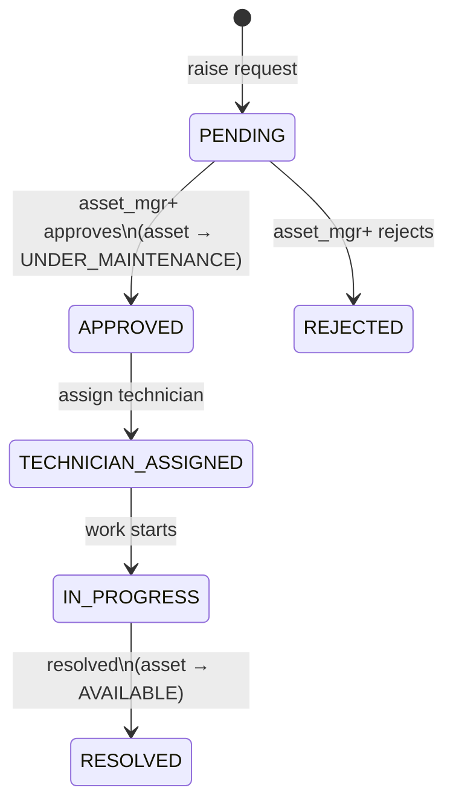
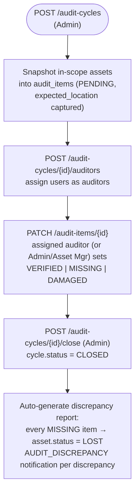
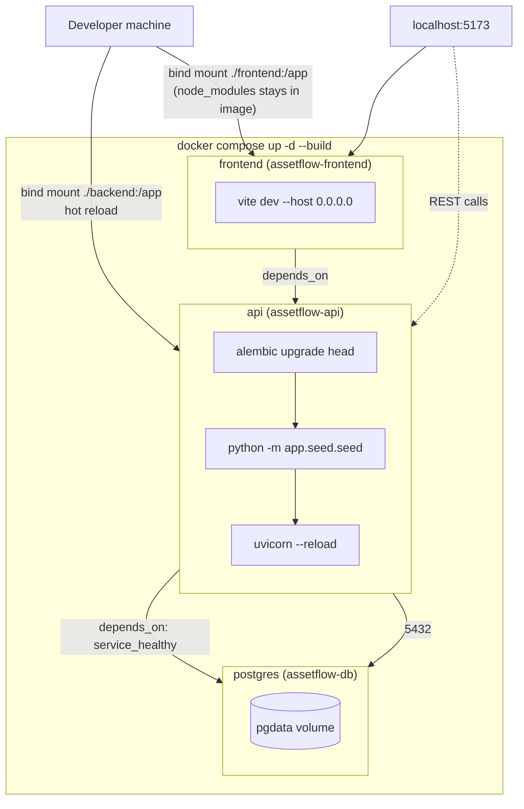

# AssetFlow — Architecture & System Documentation

This document describes how AssetFlow is actually built: the data model, the authentication
and authorization model, the core workflows (including the two "crown jewel" conflict rules),
and the system/deployment architecture. It complements [`design.md`](design.md), which is the
frozen specification this implementation was built against.

## Table of contents

1. [System architecture](#1-system-architecture)
2. [Layered request flow](#2-layered-request-flow)
3. [Data model](#3-data-model)
4. [Authentication & authorization](#4-authentication--authorization)
5. [Asset lifecycle](#5-asset-lifecycle)
6. [Core workflows](#6-core-workflows)
7. [Notifications & activity log](#7-notifications--activity-log)
8. [Deployment architecture](#8-deployment-architecture)

---

## 1. System architecture

A single-organization, single-tenant system. The frontend talks to the API exclusively over
JSON/HTTPS with a bearer JWT; there is no direct database access from the client and no
row-level security — every authorization decision is made in the FastAPI layer.



**Design principles:**
- **Contract-first parallelization.** The full schema and API surface (`design.md` §3, §11)
  were frozen before implementation began, letting four developers build independent feature
  tracks against agreed contracts without blocking on each other's code.
- **Thin routers, fat services.** Routers only decode the request, apply the role guard, and
  call a service function. All business rules, transactions, and conflict checks live in
  `services/`.
- **Defense in depth.** The two rules the system is judged on — no double allocation, no
  overlapping bookings — are enforced once in application code (for a friendly, informative
  error) and once again as a database constraint (as the unconditional guarantee).
- **No RLS, no managed auth backend.** Authorization is plain Python in FastAPI dependencies,
  by design — simpler to reason about and debug under hackathon time pressure than database
  policies.

---

## 2. Layered request flow

Every mutating request follows the same shape. Example: allocating an asset.

```mermaid
sequenceDiagram
    participant U as Employee/Manager (browser)
    participant R as routers/allocation.py
    participant D as deps.py (auth guard)
    participant S as services/allocation_service.py
    participant DB as PostgreSQL

    U->>R: POST /api/allocations {asset_id, holder_user_id}
    R->>D: get_current_user(token)
    D-->>R: current_user (id, role, department_id)
    R->>D: require_role(ADMIN, ASSET_MANAGER, DEPARTMENT_HEAD)
    D-->>R: 403 if role not permitted (request ends)
    R->>S: allocate(db, data, actor)
    S->>DB: SELECT active allocation WHERE asset_id = ...
    alt asset already allocated
        DB-->>S: existing ACTIVE row
        S-->>R: 409 asset_already_allocated + current_holder + suggested_action
        R-->>U: 409 (friendly conflict body)
    else asset free
        DB-->>S: none
        S->>DB: INSERT allocation (ACTIVE); UPDATE asset.status = ALLOCATED
        S->>DB: INSERT activity_logs("asset.allocated")
        S->>DB: INSERT notifications(ASSET_ASSIGNED)
        DB-->>S: commit
        S-->>R: AllocationOut
        R-->>U: 200 allocation created
    end
```

Routers never issue SQL directly; services never see `Request`/`Response` objects. This split
is what let each feature track (Section 12 of `design.md`) own its files without touching
shared code, other than one `include_router(...)` line per module in `main.py`.

---

## 3. Data model

All tables use UUID primary keys (`gen_random_uuid()`) and `created_at`/`updated_at`
timestamps. Enums are native Postgres enum types mirrored by Python `str, Enum` classes.



### Crown-jewel constraints

| Rule | Constraint | Why it can't be bypassed |
|---|---|---|
| **At most one active allocation per asset** | `CREATE UNIQUE INDEX one_active_allocation_per_asset ON allocations (asset_id) WHERE returned_at IS NULL;` | A partial unique index — Postgres physically refuses a second row with `returned_at IS NULL` for the same `asset_id`, regardless of what the application code does. |
| **No two overlapping bookings on the same asset** | `ALTER TABLE bookings ADD CONSTRAINT no_overlapping_bookings EXCLUDE USING gist (asset_id WITH =, time_range WITH &&) WHERE (status <> 'CANCELLED');` | A GIST exclusion constraint over `tstzrange` — any insert whose time range intersects (`&&`) an existing non-cancelled booking on the same asset is rejected at the database level, with correct half-open `[start, end)` semantics. |

Both are pre-checked in the corresponding service (`allocation_service.allocate`,
`booking_service.create`) so the user sees a descriptive `409` instead of a raw
`IntegrityError` — but the constraint is what actually guarantees correctness under
concurrent requests.

---

## 4. Authentication & authorization



- **No refresh tokens.** A single 8-hour access token is issued at login — long enough for a
  demo/working session, deliberately simple for a hackathon build.
- **Roles are never self-assigned.** `POST /auth/signup` always creates an `EMPLOYEE`
  regardless of request body. The *only* place a role changes is
  `PATCH /employees/{id}` (Admin-only).
- **Department Head scoping** is enforced by comparing `current_user.department_id` against
  the relevant record's department inside the service function — there is no row-level
  security in Postgres; every scoping decision is explicit Python.

### Role / permission matrix

`✔` = allowed · `dept` = allowed only within own department · `own` = only own records ·
`assigned auditor` = allowed only if listed in `audit_cycle_auditors` for that cycle,
independent of base role.

| Action | Admin | Asset Mgr | Dept Head | Employee |
|---|:--:|:--:|:--:|:--:|
| Manage departments / categories | ✔ | | | |
| View employee directory | ✔ | ✔ | dept | |
| Promote/demote roles, set user status | ✔ | | | |
| Create audit cycle / assign auditors / close | ✔ | | | |
| View org-wide analytics | ✔ | ✔ | dept | |
| Register / edit / retire / dispose asset | ✔ | ✔ | | |
| Allocate asset / approve return | ✔ | ✔ | dept | |
| Initiate transfer request | ✔ | ✔ | dept | own |
| Approve transfer | ✔ | ✔ | dept | |
| Raise maintenance request | ✔ | ✔ | ✔ | ✔ |
| Approve/reject/progress/resolve maintenance | ✔ | ✔ | | |
| Book / cancel resource | ✔ | ✔ | dept | ✔ |
| Perform audit verification (mark item) | ✔ | ✔ | assigned auditor | assigned auditor |
| View own allocations / notifications | ✔ | ✔ | ✔ | ✔ |
| View activity log | ✔ | ✔ | dept | own |

---

## 5. Asset lifecycle

The `assets.status` field is state-machine driven — never edited freely except for the
explicit Admin retire/dispose action.



`RESERVED` exists as an enum value for future use (reserving a *non-bookable* asset ahead of an
allocation) but is intentionally unused in this build — bookable assets (rooms, vehicles) stay
`AVAILABLE` at the asset level, with availability expressed entirely through the `bookings`
table and its overlap constraint.

**Related state machines:**
- **Allocation:** `ACTIVE → RETURNED`
- **Transfer:** `REQUESTED → APPROVED → COMPLETED`, or `REQUESTED → REJECTED`
- **Booking:** temporal `UPCOMING → ONGOING → COMPLETED` (derived at read time from
  `time_range` vs. `now()`); explicit `→ CANCELLED`
- **Maintenance:** `PENDING → APPROVED → TECHNICIAN_ASSIGNED → IN_PROGRESS → RESOLVED`, or
  `PENDING → REJECTED`
- **Audit cycle:** `OPEN → CLOSED` (one-way). **Audit item:** `PENDING → VERIFIED | MISSING | DAMAGED`

---

## 6. Core workflows

### 6.1 Double allocation & transfer (crown jewel #1)



### 6.2 Booking overlap (crown jewel #2)



Half-open ranges (`[start, end)`) mean a booking ending at 10:00 and one starting at 10:00 do
not conflict. Cancel sets `status = CANCELLED` (frees the exclusion constraint); reschedule is
cancel-then-create inside one transaction, re-running the same overlap check.

### 6.3 Maintenance kanban



### 6.4 Audit cycle



---

## 7. Notifications & activity log

Two kinds of notification, since there is no background scheduler in this build:

- **Event notifications** — written synchronously, in the same transaction as the triggering
  action: `ASSET_ASSIGNED`, `TRANSFER_APPROVED`, `MAINTENANCE_APPROVED`/`REJECTED`,
  `BOOKING_CONFIRMED`/`CANCELLED`, `AUDIT_DISCREPANCY`.
- **Derived notifications** — computed on read by `notifications_service.sync_derived()`,
  called at the top of `GET /dashboard` and `GET /notifications` so overdue/reminder items are
  always current without a cron job:
  - `OVERDUE_RETURN` — active allocations with `expected_return_date < today` lacking one.
  - `BOOKING_REMINDER` — `UPCOMING` bookings starting within the next N minutes lacking one.

Every state-changing service call writes one row to `activity_logs` with a namespaced, stable
action string (`asset.allocated`, `asset.transferred`, `booking.created`,
`maintenance.approved`, `audit.cycle_closed`, `user.role_changed`, …), giving a full audit
trail independent of the audit-cycle feature.

---

## 8. Deployment architecture



A single `docker compose up -d --build` is the only command needed:

1. `postgres` builds/starts and Compose waits for its healthcheck (`pg_isready`).
2. `api` builds, then its startup command runs migrations, then the idempotent seed script,
   then starts Uvicorn with `--reload` — all as one shell chain, so there is no manual step
   between "container up" and "fully seeded and serving."
3. `frontend` builds and starts the Vite dev server once `api` is up.

Source directories are bind-mounted into both `api` and `frontend` for hot reload during
development; the frontend container keeps its own image-built `node_modules` via an anonymous
volume (`/app/node_modules`) so the host's `node_modules` (or lack thereof) never leaks in.

Seeding is safe to run on every container start because it is upsert-by-natural-key
(`get_or_create`) — the first boot populates demo data, every subsequent boot is a no-op unless
`--reset` is passed explicitly.
